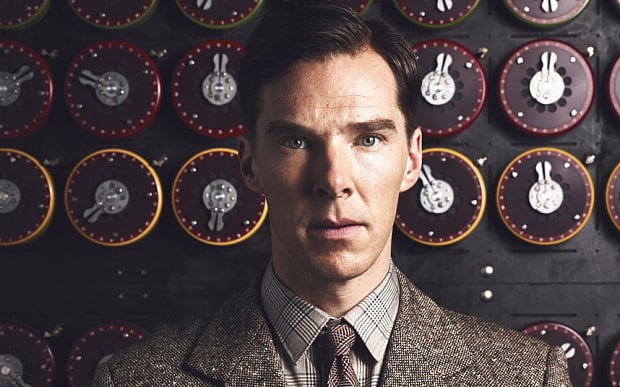
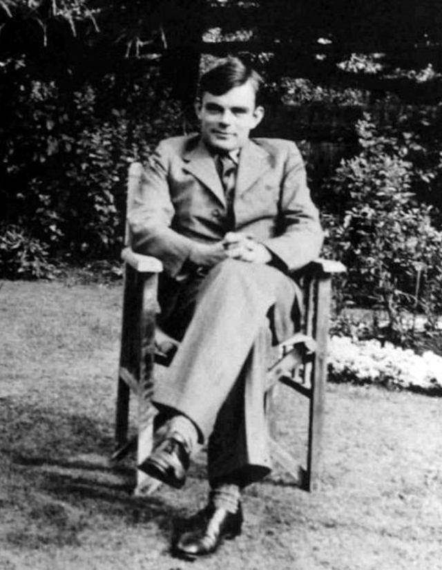
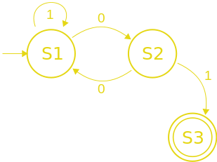
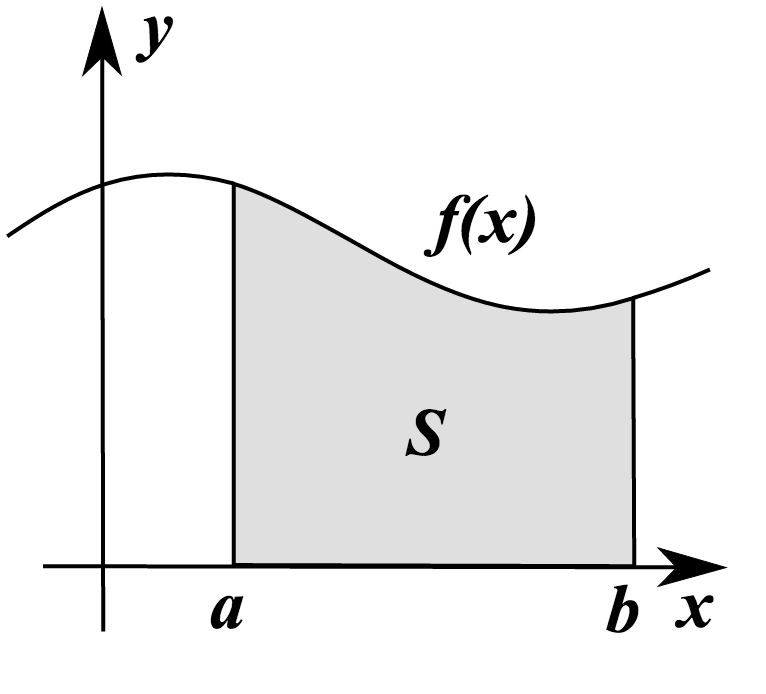

# [fit] `Impossible`

 

# [fit] `Code`

---

# [fit] Programs
# [fit] that
# [fit] cannot
# [fit] exist

---

## Are there programs that can never be written?

---

# What do we consider a "program"

 

##  Let's formalize

^ But we have someone to thank first

---

# [fit] Sherlock Holmes

^ NOPE

---

# [fit] KHAAAAAAAAAAAAAAANNNNN!!!!

^ NOPE

---

# [fit] Alan Turing

^ NOPE

---

# [fit] Alan Turing

^ But seriously, go see `The Imitation Game`

---

# British Mathematician

- Created the formalization of computability
  - Follows Kurt Gödel's work on the limit of provability
- Cryptanalysis
  - Most noted for breaking the Enigma machine encryption
- "Turing Test"

---

# _"Turing Machine"_

---

# Formalization

A "machine" that operates against an infinite _tape_ which is comprised of a sequence of symbols from an alphabet (typically `{1,0}`), one per _square_ on the tape.

When the machine `reads` a symbol on the tape it makes a decision to possibly change the symbol on the tape and then move left or right one cell.

---

---

# [fit] What does the
# [fit] `code`
# [fit] look like?

 

## [fit] State machine

---

# [fit] Halting Problem

 

## Can we write a program that for
## `any` _arbitrary_ program and
## `any` _arbitrary_ input
## determine if that *program* stops?

---

# [fit] But first ... a rant

 

# [fit] on Mathematical education

^ Ask what math people learned in high school and college

---

# Integral as region under the curve

---

# This made sense for the _industrial age_

---

# … but in the information age …

 

# we need a different _"advanced math"_ approach

---

# What makes more sense?

---

# [fit] Set Theory
# [fit] Number Theory
# [fit] Group Theory

---

# [fit] Set Theory

 

## Study of collections and Operations

### Inclusion, Exclusion, Union
### Intersection, Difference, …

---

# [fit] Number Theory

 

# Study of the Integers

## Simple to state, but deep and intriguing, theorems.

### Prime Number Theorem, Fermat's Last Theorem

^ Prime Number Theorem: Primes become less common as they become larger

^ Fermat's Last Theorem: a^n + b^n = c^n - no solution in integers for n > 2

---

# [fit] Group Theory

 

# Study of structures or groups

## Permutations, Symmetry, Modular arithmetic

---

# [fit] Information Age

 

## [fit] Dealing with transforming data into information
## [fit] Collections (often quite large) of data
## [fit] Classification (group) and permutations of data

---

# [fit] `</rant>`

---

# [fit] But second ... a bit about proofs

---

# [fit] *Many* forms of proofs

- Direct
- Contradiction
- Reducto ad Absurdum
- Existence
- Uniqueness
- Induction
- Construction
- …

---

# [fit] Proof by Contradiction

---

# Start with the opposite of the statement you wish to prove

---

# [fit] Use only existing premises

 

# [fit] _axioms, other proofs_

---

# [fit] If you reach an impossible state

 

# [fit] then the opposite statement is false

 

# [fit] and thus the statement is true.

---

# [fit] Example

---

# [fit] $$\sqrt{2}$$ is irrational

---

# Givens

 

- Any number written in the form $$2n$$ must be even

- If $$n^2$$ is even then $$n$$ must be even

- If $$n^2$$ is even then $$n^2$$ must be a multiple of $$4$$

---

## [fit] Rational numbers can be written in form $$\frac{a}{b}$$

- $$a$$ and $$b$$ are whole numbers that share no prime factors.
- One or both $$a$$ or $$b$$ must be odd
- Both $$a$$ and $$b$$ cannot be even

---

# [fit] Proof by Contradiction

- Assume there is a rational number $$\frac{a}{b} = \sqrt{2}$$

---

# [fit] Deduce information about $$a$$

- If $$\frac{a}{b} = \sqrt{2}$$ then
- $$\frac{a^2}{b^2} = 2$$
- $$a^2 = 2b^2$$
- *(given)* Thus $$a^2$$ must be even
- *(given)* Thus $$a$$ is even

---

# [fit] Deduce information about $$b$$

- $$a^2 = 2b^2$$ and $$a$$ is even
- *(given)* Thus $$a^2$$ is a multiple of four and can be written as $$4n$$ where $$n$$ is odd
- $$4n$$ = $$2b^2$$
- $$2n$$ = $$b^2$$
- *(given)* thus $$b^2$$ is even — and *(given)* thus $$b$$ is even

---

# [fit] **CONTRADICTION** :bomb: :boom:

 

# [fit] both $$a$$ and $$b$$ cannot be even

---

## [fit] Started with assumption there could be a rational number

 

## [fit] Arrived at contradiction

 

## [fit] Thus there is no rational number $$\frac{a}{b} = \sqrt{2}$$

---

# [fit] Halting Problem

---

# Halting problem

- Assume there is a machine **H** that can determine if any program and input will halt
- (what we wish to prove)

---

# [fit] Construct a new program

 

- Make a new program named **X** that:
  - Takes a program as its input
  - Feeds that program to **H** as both the **program** and the **input**

---

# **X**'s program: Flips the Script

 

# [fit] If H reports `HALT` then **X** will get stuck (`NOT HALT`)

 

# [fit] If H reports `NOT HALT` then **X** will terminate (`HALT`)

---

# Proof

- Let's feed **X** its own program

- **X** passes itself as program and input to **H**

---

# [fit] What happens if **H** reports `HALT`?

- Let's feed **X** its own program

- **X** passes itself as program and input to **H**

- **H** reports `HALT` then **X** get's stuck.

- But **H** said it would `HALT`. Potential **CONTRADICTION**

---

# [fit] What happens if **H** reports `NOT HALT`?

- Let's feed **X** its own program

- **X** passes itself as program and input to **H**

- **H** reports `NOT HALT` then **X** halts.

- But **H** said it wouldn't `HALT`. Potential **CONTRADICTION**

---

# Proof

- Both possibilities for **X** lead to a **CONTRADICTION**

- :bomb: :boom:

- Thus our initial assumption must be false

 

# [fit] No machine **H** can exist

---

# Implications

- Optimizing compiler design
- Computer security
- Parsers
- Malware scanners

---

# What to do?

- Realize that, thankfully, this problem doesn't come up in most fields

- Avoid explicit infinite loops

- When programming a general purpose language, use a style that guide to a style that halts.

- Program in a _not-quite-turing-complete_ language, one that *can* guarantee all code completes

---

# [fit] Further discussion

---

# [fit] Gödel's Incompleteness Theorem

 

# [fit] P vs. NP

---
